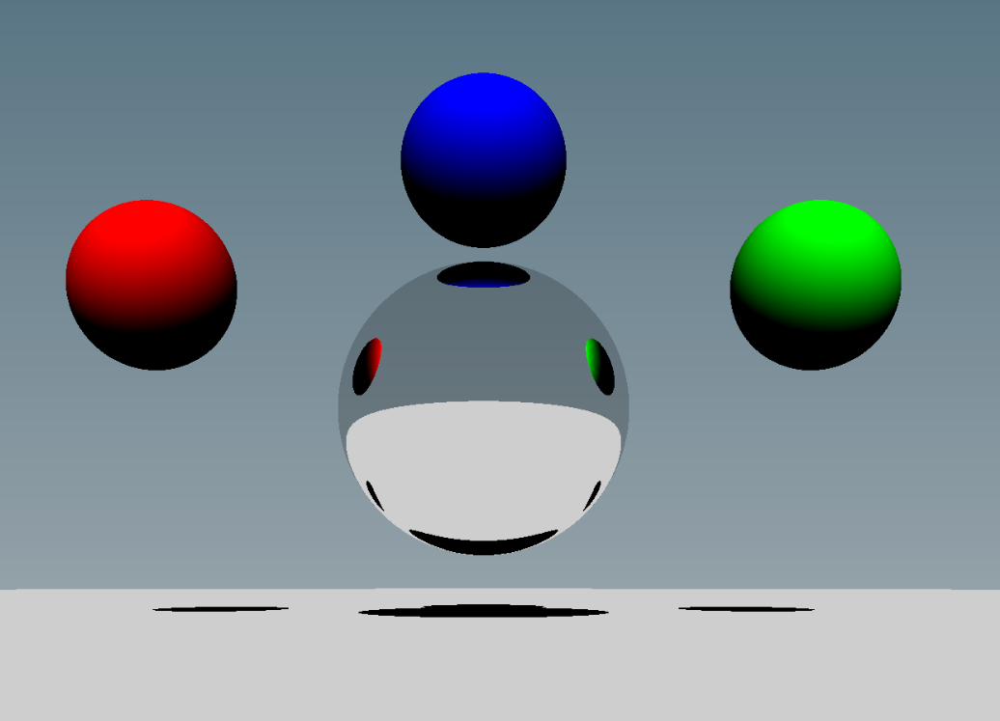

# raytracer

### Build Instructions with `vcpkg` / `cmake`
0. Setup [vcpkg](https://github.com/microsoft/vcpkg#quick-start)
1. `vcpkg install tinyobjloader glfw3 imgui glew opengl glm spdlog doctest lua lua[cpp] --recurse --triplet x64-(osx/windows/linux)-static`
2. `vcpkg integrate install`, save the toolchain file argument it spits out
3. `mkdir build && cmake .. -DCMAKE_TOOLCHAIN_FILE=… -DVCPKG_TARGET_TRIPLET=x64-(osx/windows/linux)-static`
4. `make && ./raytrace_release`